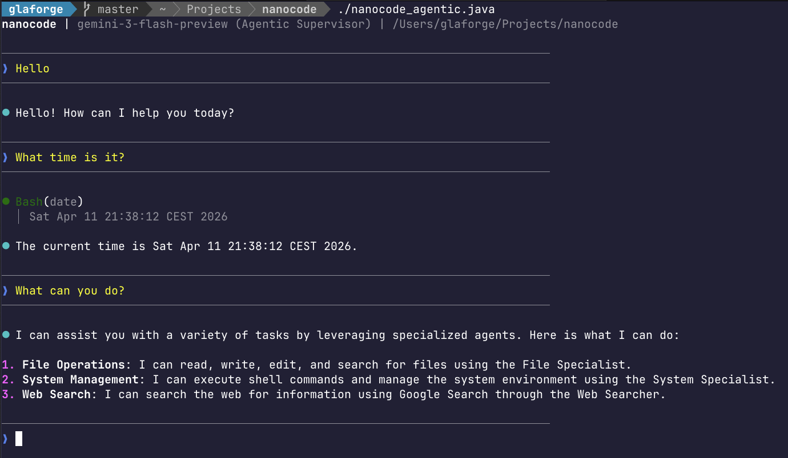

# nanocode

A minimal, single-file coding agent implemented in Java. Powered by **LangChain4j** and **Google AI Gemini**.

This repository contains two variants of a terminal-based coding assistant that can interact with your local filesystem, execute shell commands, and search the web.



## Credits

This project was inspired by [Max Rydahl Andersen's article](https://xam.dk/blog/nanocode-coding-agent-in-260-lines-of-java/) and is a fork of his original [nanocode](https://github.com/maxandersen/nanocode) repository.

## Variants

### 1. Basic Agent (`nanocode_basic.java`)
A monolithic implementation using LangChain4j `AiServices`.
- **Architecture**: Single agent with access to all tools.
- **Library**: Uses `langchain4j-google-ai-gemini`.

### 2. Multi-Agent Supervisor (`nanocode_agentic.java`)
An implementation using the experimental **LangChain4j Agentic** module.
- **Architecture**: A **Supervisor Agent** that orchestrates specialized sub-agents:
    - **`file_specialist`**: Filesystem navigation and manipulation.
    - **`system_specialist`**: Shell command execution and system management.
    - **`web_searcher`**: Internet research via Gemini's built-in Google Search.
- **Library**: Uses `langchain4j-agentic`.

## Features

- **Agentic Loop**: Autonomous reasoning and tool usage.
- **Modern Java**: Uses **Java 25** preview features (including `java.lang.IO`).
- **Gemini 3 Integration**: Configured for `gemini-3-flash-preview` with thinking enabled.
- **Terminal Rendering**: ANSI-highlighted Markdown output.
- **Interactive UI**: Yellow user input and tool execution logs.

## Requirements

- **Java 25+**: (Uses preview features like Implicitly Declared Classes and the `IO` class).
- **[JBang](https://jbang.dev)**: For running the single-file scripts.
- **API Key**: A Google AI Gemini API key.

## Usage

```bash
export GOOGLE_AI_GEMINI_API_KEY="your-key"

# Run the basic variant
./nanocode_basic.java

# OR run the multi-agent variant
./nanocode_agentic.java
```

## Tools

| Tool | Description |
|------|-------------|
| `read` | Read file with line numbers, offset/limit |
| `write` | Create or overwrite files |
| `edit` | Replace strings in files |
| `glob` | Find files by pattern |
| `grep` | Search file contents for regex patterns |
| `bash` | Run shell commands (supports optional `dir`) |
| `websearch` | Internet research using Google Search |

## Commands

- `/c` - Clear conversation history.
- `/q` or `exit` - Quit the application.

## License

MIT
